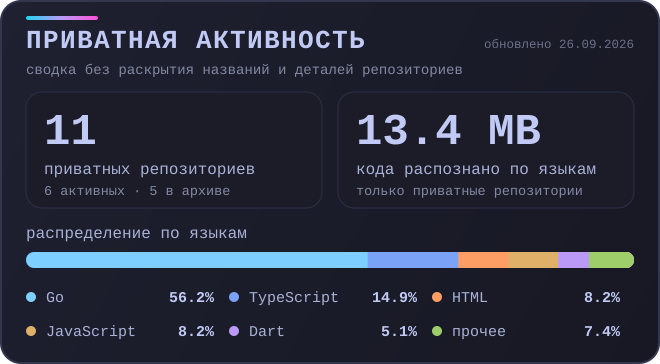

<p align="center">
  <a href="https://hdqwalls.com/anime-cyber-girl-neon-city-wallpaper">
    
  </a>
</p>

<h1 align="center">MrNo1ze</h1>

<p align="center">
  <b>DevOps • Backend • Infrastructure • Automation</b>
</p>

<p align="center">
  
</p>

<p align="center">
  
  
  
  
</p>

<p align="center">
  <a href="https://skillicons.dev">
    
  </a>
</p>

---

### `~/whoami`

```ts
const mrno1ze = {
  domain: ["backend", "devops", "infrastructure"],
  main: ["Go", "TypeScript"],
  runtime: ["Docker", "Linux", "Nginx"],
  data: ["PostgreSQL", "Redis"],
  interests: ["automation", "networking", "observability", "self-hosting"],
  visibility: "mostly private 🔒",
};
```

I build backend services and the infrastructure around them. Most of the interesting code here lives in private repositories, so public stars and public-repository counters are deliberately not used as headline metrics.

### `~/build-matrix`

| Backend | Infrastructure | Edge / Networking |
| :--- | :--- | :--- |
| APIs, services, workers | containers, deployments, automation | routing, proxies, DNS, ingress |
| Go / TypeScript | Docker / Linux / Ansible | Nginx / Cloudflare / networking |
| boring, predictable runtime | reproducible environments | fewer mysterious packets |

### `~/private-signal`

<p align="center">
  
</p>

<sub>
Snapshot aggregated from private repositories accessible to my GitHub account. Repository names, commit messages and repository-specific details are not exposed.
</sub>

### `~/operating-mode`

```text
$ cat /etc/mrno1ze

code        private-first
infra       automated
deploy      reproducible
network     suspicious until proven innocent
logs        observable
rollback    available
coffee      required
```

<details>
<summary><b>~/toolbox --all</b></summary>
<br>

<p align="center">
  
</p>

```text
backend      Go · TypeScript · JavaScript
infra        Docker · Linux · Nginx · Ansible · Shell
data         PostgreSQL · Redis
web          HTML · CSS
workflow     Git · GitHub Actions · VS Code
edge         Cloudflare · proxies · routing
```

</details>

### `~/principles`

```bash
manual twice?      automate it
fragile deploy?    containerize it
can't explain it?  observe it
works only once?   it doesn't work
production bug?    now we have documentation
```

---

<p align="center">
  <sub>private repos • production systems • questionable sleep schedule</sub>
</p>

<p align="center">
  <sub>
    Header artwork:
    <a href="https://www.artstation.com/yuzuriha_moon">yuzuriha_moon</a>
    •
    <a href="https://hdqwalls.com/anime-cyber-girl-neon-city-wallpaper">source</a>
  </sub>
</p>
